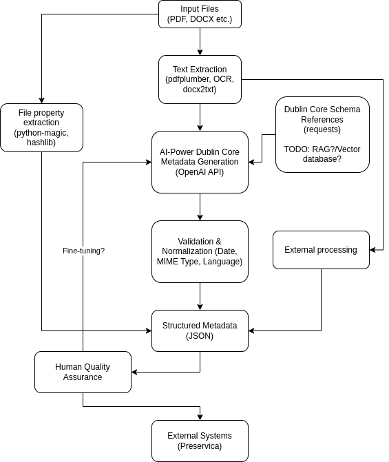

# **Dublin Core Metadata Extraction [EXPERIMENTAL]**

## **Overview**
**Dublin Core Metadata Extraction** is an **AI-powered system** that automates **document metadata extraction, classification, validation, and structuring** based on **Dublin Core standards**. It intelligently **analyzes PDFs and Word documents**, extracting key attributes while ensuring metadata is **accurate, structured, and integration-ready**.

---

## **Key Features**
✅ **Hybrid Extraction** – Extracts text from **PDFs using `pdfplumber`**, and from **DOC/DOCX using `docx2txt`, `textract`, and LibreOffice conversion**.  
✅ **AI-Driven Metadata Mapping** – Uses **OpenAI’s GPT-4** to extract and structure metadata into **Dublin Core fields**.  
✅ **Context-Aware Metadata Extraction** – Dynamically loads **Dublin Core metadata definitions** from a structured **JSON file** (`context.json`).  
✅ **Structured Output** – Saves metadata as **JSON and CSV**, ensuring compatibility with **archives, databases, and APIs**.  
✅ **Optimized Processing** – Utilizes **multiprocessing** to speed up large-scale document analysis.  

---

## **Workflow Overview**

---

## **Requirements**
Ensure you have **Python 3.8+** installed.

### **Required Libraries**
The system relies on the following key libraries:
- **`pdfplumber`** – Extracts text from PDFs.
- **`docx2txt` & `textract`** – Extracts text from Word documents.
- **`openai`** – AI-powered metadata generation.
- **`pydantic`** – Validates structured metadata fields.
- **`python-dotenv`** – Manages API keys securely.

---