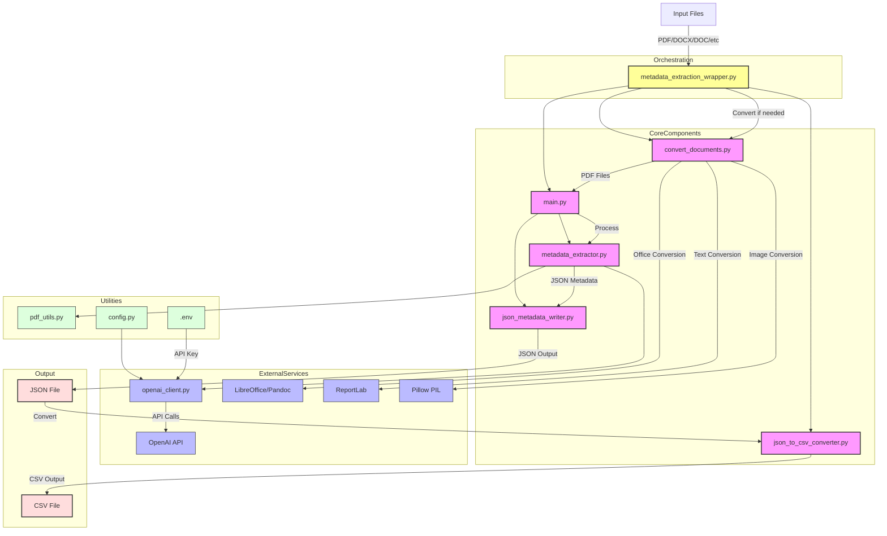

# Metadata Extraction Tool

An experimental AI-powered metadata extraction system that processes various document formats and extracts structured metadata using OpenAI's API. The system follows ICAEW-specific conventions and demonstrates automated document processing workflows.

## Overview

This project showcases an end-to-end document processing pipeline that:
- Converts multiple document formats to PDF for consistent processing
- Extracts structured metadata using AI/LLM technology
- Outputs results in both JSON and CSV formats
- Preserves original format information throughout the pipeline

## System Architecture



The system follows a modular architecture where:
- `metadata_extraction_wrapper.py` orchestrates the complete workflow (convert + extract + convert to CSV)
- `convert_documents.py` converts various file formats to PDF for processing
- `main.py` handles CLI interaction and orchestrates the extraction process (PDF-focused)
- `metadata_extractor.py` manages the core extraction logic
- `json_metadata_writer.py` handles JSON output formatting
- `json_to_csv_converter.py` converts JSON metadata to CSV format
- `openai_client.py` provides the OpenAI API integration
- `pdf_utils.py` handles PDF file operations
- `config.py` centralizes configuration settings

## Format Mapping and Preservation

The system automatically creates a `format_mapping.json` file during document conversion to preserve original file format information. This ensures that:

- **Accurate Metadata**: The `dc:format` field correctly shows the original format (e.g., "xlsx", "pptx", "jpg") instead of "pdf"
- **Format Tracking**: Each converted PDF is linked to its original source format
- **Metadata Integrity**: Users can distinguish between native PDFs and converted documents
- **Audit Trail**: Complete visibility into the conversion process

### Format Mapping Example:
```json
{
  "downloads/document.pdf": "xlsx",
  "downloads/presentation.pdf": "pptx",
  "downloads/image.pdf": "jpg"
}
```

## Technical Implementation

The system is built with Python and integrates several key technologies:
- **OpenAI API**: For AI-powered metadata extraction
- **LibreOffice/Pandoc**: For document format conversion
- **ReportLab**: For text-to-PDF conversion
- **PyPDF2**: For PDF file operations
- **JSON/CSV**: For structured data output

### Why PDF Conversion?

The system converts all documents to PDF before LLM processing to provide:
- **Consistent Input Format**: Standardized structure for reliable LLM processing
- **Preserved Layout**: Maintains document hierarchy and formatting context
- **Clean Text Extraction**: Reliable text extraction with preserved structure
- **Format Preservation**: Original format information maintained in metadata

## Supported File Formats

The tool supports the following file formats:
- **PDF** (.pdf) - Processed directly
- **DOCX** (.docx) - Converted to PDF using LibreOffice/Pandoc
- **DOC** (.doc) - Converted to PDF using LibreOffice/Pandoc
- **XLSX** (.xlsx) - Converted to PDF using LibreOffice/Pandoc (NEW)
- **PPTX** (.pptx) - Converted to PDF using LibreOffice/Pandoc (NEW)
- **PPT** (.ppt) - Converted to PDF using LibreOffice/Pandoc (NEW)
- **TXT** (.txt) - Converted to PDF using ReportLab
- **SRT** (.srt) - Converted to PDF using ReportLab with subtitle cleaning
- **VTT** (.vtt) - Converted to PDF using ReportLab with WebVTT cleaning (NEW)
- **Images** (.jpg, .jpeg, .png, .tiff, .tif) - Converted to PDF using Pillow (NEW)

### Document Conversion Methods:
- **Office Documents** (DOCX/DOC/XLSX/PPTX/PPT): LibreOffice (preferred) or Pandoc
- **Text Files** (TXT/SRT/VTT): Python ReportLab library
- **Image Files** (JPG/PNG/TIFF): Python Pillow library
- **PDF Files**: Passed through unchanged

### Subtitle File Processing:
Subtitle files (.srt, .vtt) are automatically cleaned during conversion:
- Removes subtitle numbers and timestamps
- Extracts only the actual subtitle text content
- Preserves paragraph structure for better metadata extraction
- WebVTT files have additional header cleaning (WEBVTT, X-TIMESTAMP-MAP, etc.)

### Image File Processing:
Image files are converted to PDF while maintaining quality:
- Supports common formats: JPG, JPEG, PNG, TIFF, TIF
- Automatic RGB conversion for compatibility
- Configurable resolution settings
- Preserves original format information for metadata extraction

## Capabilities

### Document Processing Pipeline

The system demonstrates a complete document processing workflow:

```bash
# Complete workflow
python metadata_extraction_wrapper.py

# Individual components
python convert_documents.py <directory_path>  # Convert to PDF
python main.py --folder pdf_directory -j output.json  # Extract metadata
python json_to_csv_converter.py output.json output.csv  # Convert to CSV
```

### Key Features

- **Multi-format Support**: Handles PDF, DOCX, DOC, XLSX, PPTX, PPT, TXT, SRT, VTT, and image files
- **Format Preservation**: Maintains original format information through conversion process
- **AI-Powered Extraction**: Uses OpenAI's API for intelligent metadata extraction
- **Dual Output**: Generates both JSON (structured) and CSV (tabular) outputs
- **Page Selection**: Supports processing specific page ranges for large documents

## Technical Architecture

### Core Components

- **`metadata_extraction_wrapper.py`**: Orchestrates the complete workflow
- **`convert_documents.py`**: Handles multi-format to PDF conversion
- **`main.py`**: PDF processing and metadata extraction
- **`metadata_extractor.py`**: AI-powered metadata extraction logic
- **`json_metadata_writer.py`**: JSON output formatting
- **`json_to_csv_converter.py`**: JSON to CSV conversion
- **`openai_client.py`**: OpenAI API integration
- **`pdf_utils.py`**: PDF file operations
- **`config.py`**: Configuration and AI prompts

## Metadata Schema

The system extracts structured metadata following ICAEW conventions:

### Core Fields
- `assetId`: File identifier
- `entity.title`: Document title
- `entity.description`: Document description

### ICAEW-Specific Fields
- `icaew:ContentType`: Content type (e.g., "Technical release", "Annual report", "Article")
- `icaew:InternalReference`: Formatted reference (YYYYMMDD-Document-Name format)
- `icaew:Notes`: Additional notes or comments

### Dublin Core Fields
- `dc:title`: Document title
- `dc:creator`: Authors, faculties, and organizations
- `dc:description`: Document summary
- `dc:publisher`: Publisher name
- `dc:contributor`: External institutions
- `dc:date`: Document date (YYYY-MM-DD format)
- `dc:type`: DCMI type values
- `dc:format`: Original file format
- `dc:identifier`: ISBNs, URLs, reference codes
- `dc:language`: ISO 639-1 language codes
- `dc:relation`: Parent folder or collection names

## AI Integration

### Content Type Classification
The system uses AI to classify documents into controlled vocabulary categories:
- Annual report, Article, Biographical profile, Company profile, Course, Database
- eBook, eBook chapter, eLearning module, Event, Form, Helpsheets and support
- Hub page, ICAEW consultation and response, Internal ICAEW policy, Journal
- Learning material, Legal precedent, Library book, Library journal, Listing
- Member reward, Minutes and board papers, Newsletter, No content type, Podcast
- Press release, Promotional material, Regional news, Regulations, Report
- Representation, Research guide, Speech or presentation, Synopsis, Technical release
- Thought leadership report, Transcript, Video, Webinar, Website

### AI Configuration
- Uses OpenAI's GPT models for intelligent metadata extraction
- Configurable prompts and extraction rules in `config.py`
- Handles complex document structures and varied content types

## Format Mapping and Preservation

The system automatically creates a `format_mapping.json` file during document conversion to preserve original file format information. This ensures that:

- **Accurate Metadata**: The `dc:format` field correctly shows the original format (e.g., "xlsx", "pptx", "jpg") instead of "pdf"
- **Format Tracking**: Each converted PDF is linked to its original source format
- **Metadata Integrity**: Users can distinguish between native PDFs and converted documents
- **Audit Trail**: Complete visibility into the conversion process

### Format Mapping Example:
```json
{
  "downloads/document.pdf": "xlsx",
  "downloads/presentation.pdf": "pptx",
  "downloads/image.pdf": "jpg"
}
```

### Supported Original Formats:
- **Office Documents**: docx, doc, xlsx, pptx, ppt
- **Text Files**: txt, srt, vtt  
- **Images**: jpg, jpeg, png, tiff, tif
- **Native**: pdf (no conversion needed)

## Dependencies

### Python Packages
- `openai>=1.0.0` - OpenAI API integration
- `python-dotenv>=1.0.0` - Environment variable management
- `PyPDF2>=3.0.0` - PDF file operations
- `reportlab>=4.0.0` - Text-to-PDF conversion

### External Tools
- **LibreOffice** - Office document conversion
- **Pandoc** - Alternative document conversion

## File Structure

```
metadata-extraction/
├── metadata_extraction_wrapper.py  # Main orchestration script
├── main.py                         # Metadata extraction CLI (PDF only)
├── convert_documents.py            # Multi-format to PDF conversion
├── metadata_extractor.py           # Core extraction logic
├── json_metadata_writer.py         # JSON output handling
├── json_to_csv_converter.py        # JSON to CSV conversion
├── metadata_writer.py              # Legacy CSV output handling
├── openai_client.py                # OpenAI API integration
├── pdf_utils.py                    # PDF file operations
├── config.py                       # Configuration and prompts
├── requirements.txt                # Python dependencies
├── .env                           # Environment variables (API keys)
└── README.md                      # This file
```

## Workflow

1. **Input**: Place files (PDF, DOCX, DOC, XLSX, PPTX, PPT, TXT, SRT, VTT, images, etc.) in the working directory
2. **Convert**: `convert_documents.py` reads files **FROM** the working directory and converts non-PDF files to PDF while preserving original format information
3. **Format Mapping**: Creates `format_mapping.json` to track original file formats for accurate metadata extraction
4. **Extract**: `main.py` reads PDF files **FROM** the working directory and processes them with correct format attribution
5. **JSON Output**: Metadata is written to JSON format using `json_metadata_writer.py`
6. **CSV Conversion**: `json_to_csv_converter.py` converts the JSON metadata to CSV format for final output

**Note**: The working directory serves as both the **input location** (step 1) and the **processing source** (steps 2 & 4). This design keeps all files in one location throughout the workflow.

The wrapper script orchestrates all steps seamlessly while keeping each component focused on its specific task. The format mapping ensures that converted files maintain their original format identity in the metadata output. The JSON-first approach allows for better data integrity and easier debugging.

## Project Status

This is an experimental project demonstrating AI-powered document processing capabilities. The system showcases:

- **Document Format Conversion**: Multi-format to PDF conversion pipeline
- **AI-Powered Metadata Extraction**: Intelligent content analysis and classification
- **Structured Data Output**: JSON and CSV format generation
- **Format Preservation**: Maintaining original file format information
- **Modular Architecture**: Component-based design for flexibility

The project serves as a proof-of-concept for automated document processing workflows using modern AI technologies.