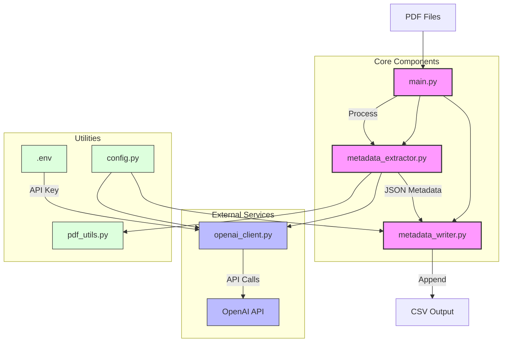

# Metadata Extraction Tool

A command-line tool for extracting metadata from PDF files using OpenAI's API. The metadata extraction follows configurable conventions defined in `config.py`.

## System Architecture



The system follows a modular architecture where:
- `main.py` handles CLI interaction and orchestrates the extraction process
- `metadata_extractor.py` manages the core extraction logic
- `metadata_writer.py` handles CSV output formatting
- `openai_client.py` provides the OpenAI API integration
- `pdf_utils.py` handles PDF file operations
- `config.py` centralizes configuration settings

## Setup

1. Create a virtual environment:
```bash
python -m venv venv
source venv/bin/activate  # On Windows: venv\Scripts\activate
```

2. Install dependencies:
```bash
pip install -r requirements.txt
```

3. Create a `.env` file with your OpenAI API key:
```
OPENAI_API_KEY=your-api-key-here
```

4. (Optional) Customize metadata conventions in `config.py` to match your requirements.

## Usage

Process a single PDF file:
```bash
python main.py --file document.pdf -c output.csv
```

Process all PDFs in a directory:
```bash
python main.py --folder pdf_directory -c output.csv
```

Process specific pages:
```bash
# First 3 pages
python main.py --file document.pdf --first 3 -c output.csv

# Last 2 pages
python main.py --file document.pdf --last 2 -c output.csv

# Both first and last pages
python main.py --file document.pdf --first 3 --last 2 -c output.csv
```

## Arguments

- `--file`, `-f`: Path to a single PDF file
- `--folder`, `-d`: Path to a directory containing PDF files
- `--first`, `-p`: Number of pages to include from the start
- `--last`, `-l`: Number of pages to include from the end
- `--csv-file`, `-c`: CSV file to write metadata to (required)

## Output

The tool generates a CSV file with the following metadata fields (customizable in `config.py`):
- filename
- entity.title
- Title
- Creator
- Subject
- Description
- Publisher
- Contributor
- Date
- Type
- Format
- Identifier
- Source
- Language
- Relation
- Coverage
- Rights