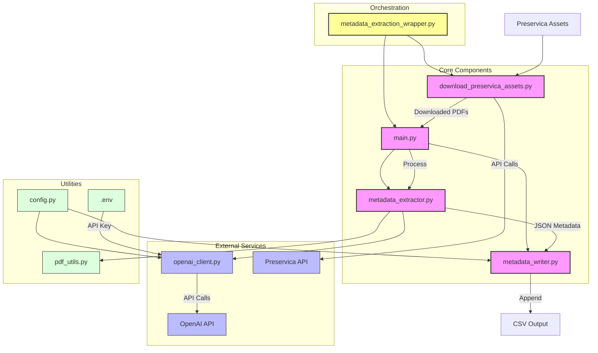

# Metadata Extraction Tool

A command-line tool for extracting metadata from PDF files using OpenAI's API. The metadata extraction follows ICAEW-specific conventions and includes a wrapper script for downloading assets from Preservica.

## System Architecture



The system follows a modular architecture where:
- `metadata_extraction_wrapper.py` orchestrates the complete workflow (download + extract)
- `download_preservica_assets.py` downloads assets from Preservica
- `main.py` handles CLI interaction and orchestrates the extraction process
- `metadata_extractor.py` manages the core extraction logic
- `metadata_writer.py` handles CSV output formatting
- `openai_client.py` provides the OpenAI API integration
- `pdf_utils.py` handles PDF file operations
- `config.py` centralizes configuration settings

## Setup

1. Create a virtual environment:
```bash
python -m venv venv
source venv/bin/activate  # On Windows: venv\Scripts\activate
```

2. Install dependencies:
```bash
pip install -r requirements.txt
```

3. Create a `.env` file with your OpenAI API key:
```
OPENAI_API_KEY=your-api-key-here
```

4. Configure the wrapper script by editing the variables at the top of `metadata_extraction_wrapper.py`

## Usage

### Option 1: Complete Workflow (Recommended)

Use the wrapper script to download from Preservica and extract metadata in one step:

```bash
python metadata_extraction_wrapper.py
```

Edit the configuration variables at the top of `metadata_extraction_wrapper.py`:
```python
# Download configuration
FOLDER_ID = "your-folder-id-here"  # Change this to your folder ID
OUTPUT_DIR = "./downloads"  # Directory where downloaded assets will be saved
CSV_OUTPUT = "metadata.csv"  # CSV file to write extracted metadata to

# Optional settings
USE_ASSET_REF = True  # Use asset reference numbers in filenames
FIRST_PAGES = 5  # Number of pages to include from the start (0 = no limit)
LAST_PAGES = 3   # Number of pages to include from the end (0 = no limit)
```

### Option 2: Individual Scripts

Process a single PDF file:
```bash
python main.py --file document.pdf -c output.csv
```

Process all PDFs in a directory:
```bash
python main.py --folder pdf_directory -c output.csv
```

Process specific pages:
```bash
# First 3 pages
python main.py --file document.pdf --first 3 -c output.csv

# Last 2 pages
python main.py --file document.pdf --last 2 -c output.csv

# Both first and last pages
python main.py --file document.pdf --first 3 --last 2 -c output.csv
```

## Arguments

### Wrapper Script
The wrapper script uses hardcoded configuration variables (no command line arguments).

### Main Script
- `--file`, `-f`: Path to a single PDF file
- `--folder`, `-d`: Path to a directory containing PDF files
- `--first`, `-p`: Number of pages to include from the start
- `--last`, `-l`: Number of pages to include from the end
- `--csv-file`, `-c`: CSV file to write metadata to (required)

## Output

The tool generates a CSV file with the following metadata fields following ICAEW conventions:

### Core Fields
- `filename/reference`: The filename of the processed PDF
- `entity.title`: Copy of the Title field
- `entity.description`: Copy of the Description field

### ICAEW-Specific Fields
- `icaew:ContentType`: Content type using controlled vocabulary (e.g., "Technical release", "Annual report", "Article")
- `icaew:InternalReference`: Formatted reference (YYYYMMDD-Document-Name format)
- `icaew:Notes`: Additional notes or comments

### Dublin Core Fields
- `Title`: Document title as it appears in the document
- `Creator`: Authors, faculties, and organizations
- `Subject`: Reserved for future use
- `Description`: Document summary or description
- `Publisher`: Publisher name as credited
- `Contributor`: External institutions involved
- `Date`: Document date in YYYY-MM-DD format
- `Type`: DCMI type values (e.g., "Text", "Moving image")
- `Format`: File format (e.g., "pdf", "docx")
- `Identifier`: ISBNs, URLs, issue numbers, reference codes
- `Source`: Reserved for future use
- `Language`: ISO 639-1 language codes (e.g., "en")
- `Relation`: Parent folder or collection names
- `Coverage`: Reserved for future use
- `Rights`: Reserved for future use

## Configuration

### Content Type Controlled Vocabulary
The `icaew:ContentType` field uses a controlled vocabulary with the following options:
- Annual report, Article, Biographical profile, Company profile, Course, Database
- eBook, eBook chapter, eLearning module, Event, Form, Helpsheets and support
- Hub page, ICAEW consultation and response, Internal ICAEW policy, Journal
- Learning material, Legal precedent, Library book, Library journal, Listing
- Member reward, Minutes and board papers, Newsletter, No content type, Podcast
- Press release, Promotional material, Regional news, Regulations, Report
- Representation, Research guide, Speech or presentation, Synopsis, Technical release
- Thought leadership report, Transcript, Video, Webinar, Website

### Customization
- Edit `config.py` to modify metadata extraction rules and prompts
- Edit the configuration variables in `metadata_extraction_wrapper.py` to change script paths and settings
- The system uses OpenAI's GPT-4 model by default (configurable in `config.py`)

## File Structure

```
metadata-extraction/
├── metadata_extraction_wrapper.py  # Main orchestration script
├── main.py                         # Metadata extraction CLI
├── download_preservica_assets.py   # Preservica download script
├── metadata_extractor.py           # Core extraction logic
├── metadata_writer.py              # CSV output handling
├── openai_client.py                # OpenAI API integration
├── pdf_utils.py                    # PDF file operations
├── config.py                       # Configuration and prompts
├── requirements.txt                # Python dependencies
├── .env                           # Environment variables (API keys)
└── README.md                      # This file

```