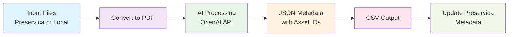
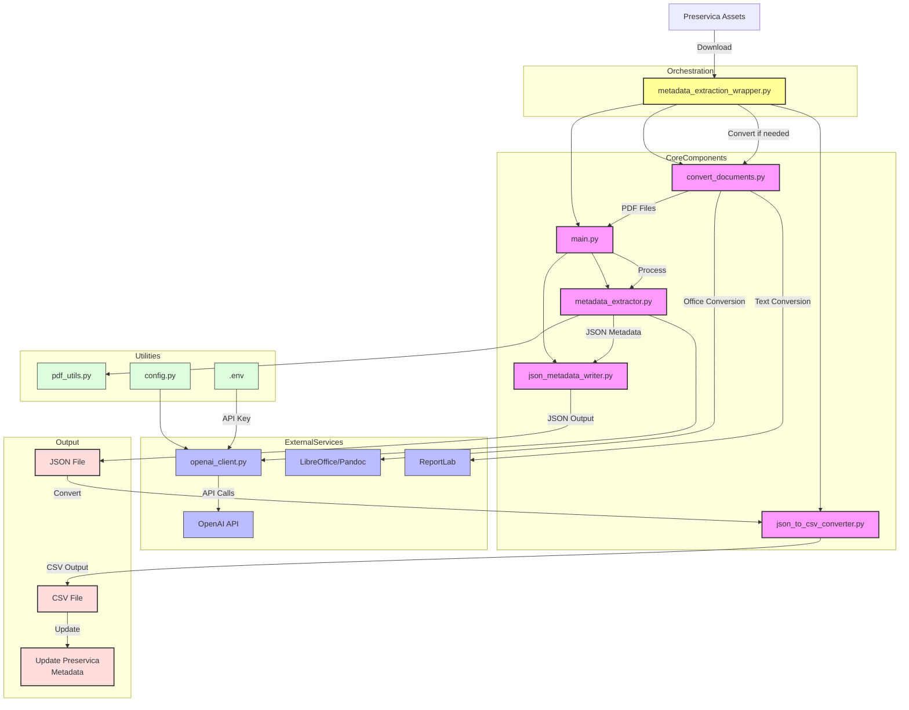

# Metadata Extraction Tool

An experimental AI-powered metadata extraction system that processes various document formats and extracts structured metadata using OpenAI's API. The system follows ICAEW-specific conventions and demonstrates automated document processing workflows.

## Overview

This project showcases an end-to-end document processing pipeline that:
- Downloads assets from Preservica digital preservation system or processes local files
- Converts multiple document formats to PDF for consistent processing
- Extracts structured metadata using AI/LLM technology
- Maintains asset ID links for metadata updates and further processing
- Outputs results in both JSON and CSV formats
- Updates Preservica metadata using the extracted information
- Preserves original format information throughout the pipeline

## Demo


*This demo shows the complete workflow: downloading assets from Preservica, AI-powered metadata extraction using OpenAI, and JSON output generation.*

## System Flow



## System Architecture



## Technical Implementation

The system is built with Python and integrates several key technologies:
- **OpenAI API**: For AI-powered metadata extraction
- **LibreOffice/Pandoc**: For document format conversion
- **ReportLab**: For text-to-PDF conversion
- **PyPDF2**: For PDF file operations
- **JSON/CSV**: For structured data output

### Why PDF Conversion?

The system converts all documents to PDF before LLM processing to provide:
- **Consistent Input Format**: Standardized structure for reliable LLM processing
- **Preserved Layout**: Maintains document hierarchy and formatting context
- **Direct AI Processing**: PDFs are uploaded directly to OpenAI for text extraction and analysis
- **Format Preservation**: Original format information maintained in metadata

## Supported File Formats

The tool supports the following file formats:
- **PDF** (.pdf) - Processed directly
- **Office Documents** (.docx, .doc, .xlsx, .pptx, .ppt) - Converted to PDF
- **Text Files** (.txt, .srt, .vtt) - Converted to PDF
- **Images** (.jpg, .jpeg, .png, .tiff, .tif) - Converted to PDF

## Capabilities

### Document Processing Pipeline

The system demonstrates a complete document processing workflow:

```bash
# Complete workflow
python metadata_extraction_wrapper.py

# Individual components
python convert_documents.py <directory_path>  # Convert to PDF
python main.py --folder pdf_directory -j output.json  # Extract metadata
python json_to_csv_converter.py output.json output.csv  # Convert to CSV
```

### Key Features

- **Multi-format Support**: Handles PDF, DOCX, DOC, XLSX, PPTX, PPT, TXT, SRT, VTT, and image files
- **Format Preservation**: Maintains original format information through conversion process
- **AI-Powered Extraction**: Uses OpenAI's API for intelligent metadata extraction
- **Dual Output**: Generates both JSON (structured) and CSV (tabular) outputs
- **Page Selection**: Supports processing specific page ranges for large documents

## Metadata Schema

The system extracts structured metadata following ICAEW conventions:

### Core Fields
- `assetId`: File identifier
- `entity.title`: Document title
- `entity.description`: Document description

### ICAEW-Specific Fields
- `icaew:ContentType`: Content type (e.g., "Technical release", "Annual report", "Article")
- `icaew:InternalReference`: Formatted reference (YYYYMMDD-Document-Name format)
- `icaew:Notes`: Additional notes or comments

### Dublin Core Fields
- `dc:title`: Document title
- `dc:creator`: Authors, faculties, and organizations
- `dc:description`: Document summary
- `dc:publisher`: Publisher name
- `dc:contributor`: External institutions
- `dc:date`: Document date (YYYY-MM-DD format)
- `dc:type`: DCMI type values
- `dc:format`: Original file format
- `dc:identifier`: ISBNs, URLs, reference codes
- `dc:language`: ISO 639-1 language codes
- `dc:relation`: Parent folder or collection names

## AI Integration

### Content Type Classification
The system uses AI to classify documents into controlled vocabulary categories:
- Annual report, Article, Biographical profile, Company profile, Course, Database
- eBook, eBook chapter, eLearning module, Event, Form, Helpsheets and support
- Hub page, ICAEW consultation and response, Internal ICAEW policy, Journal
- Learning material, Legal precedent, Library book, Library journal, Listing
- Member reward, Minutes and board papers, Newsletter, No content type, Podcast
- Press release, Promotional material, Regional news, Regulations, Report
- Representation, Research guide, Speech or presentation, Synopsis, Technical release
- Thought leadership report, Transcript, Video, Webinar, Website

### AI Configuration
- Uses OpenAI's GPT models for intelligent metadata extraction
- Configurable prompts and extraction rules in `config.py`
- Handles complex document structures and varied content types

## Format Mapping and Preservation

The system automatically creates a `format_mapping.json` file during document conversion to preserve original file format information. This ensures that:

- **Accurate Metadata**: The `dc:format` field correctly shows the original format (e.g., "xlsx", "pptx", "jpg") instead of "pdf"
- **Format Tracking**: Each converted PDF is linked to its original source format
- **Metadata Integrity**: Users can distinguish between native PDFs and converted documents
- **Audit Trail**: Complete visibility into the conversion process

### Format Mapping Example:
```json
{
  "downloads/document.pdf": "xlsx",
  "downloads/presentation.pdf": "pptx",
  "downloads/image.pdf": "jpg"
}
```

## Dependencies

- **Python Packages**: openai, python-dotenv, PyPDF2, reportlab
- **External Tools**: LibreOffice or Pandoc for document conversion

## File Structure

Key files:
- `metadata_extraction_wrapper.py` - Main orchestration script
- `main.py` - Metadata extraction CLI
- `convert_documents.py` - Multi-format to PDF conversion
- `metadata_extractor.py` - Core extraction logic
- `json_metadata_writer.py` - JSON output handling
- `json_to_csv_converter.py` - JSON to CSV conversion
- `openai_client.py` - OpenAI API integration
- `config.py` - Configuration and prompts

## Workflow

1. **Input**: Assets downloaded from Preservica or local files placed in working directory
2. **Convert**: Non-PDF files converted to PDF while preserving original format information
3. **Extract**: AI-powered metadata extraction from PDF files
4. **Output**: Metadata written to JSON format
5. **Convert**: JSON metadata converted to CSV format
6. **Update**: CSV output used to update Preservica metadata using preserved asset IDs

## Preservica Integration

The system integrates with Preservica digital preservation system to:

- **Asset Download**: Downloads assets from Preservica using folder or asset references
- **Asset ID Tracking**: Maintains Preservica asset IDs throughout the processing pipeline
- **Metadata Linking**: Links extracted metadata back to original Preservica assets
- **Update Capability**: Enables further scripting to update Preservica metadata using extracted information

### Asset ID Preservation

Each processed document maintains its Preservica asset ID in the output metadata:
- **JSON Output**: Asset ID stored in `assetId` field for each record
- **CSV Output**: Asset ID included as first column for easy reference
- **Update Workflow**: Asset IDs enable automated metadata updates back to Preservica

### Metadata Update Process

The CSV output serves as the primary input for updating Preservica metadata:
- **Structured Data**: CSV format provides clean, tabular data for bulk updates
- **Asset Linking**: First column contains Preservica asset IDs for precise targeting
- **Bulk Processing**: Enables efficient batch updates of multiple assets
- **Data Integrity**: Preserves all extracted metadata fields for comprehensive updates

## Project Status

This is an experimental project demonstrating AI-powered document processing capabilities. The system showcases:

- **Preservica Integration**: Seamless download and metadata linking with digital preservation system
- **Document Format Conversion**: Multi-format to PDF conversion pipeline
- **AI-Powered Metadata Extraction**: Intelligent content analysis and classification
- **Structured Data Output**: JSON and CSV format generation with asset tracking
- **Metadata Update Workflow**: CSV output enables bulk updates back to Preservica
- **Format Preservation**: Maintaining original file format information
- **Modular Architecture**: Component-based design for flexibility

The project serves as a proof-of-concept for automated document processing workflows using modern AI technologies, with the ultimate goal of enhancing Preservica metadata through AI-powered extraction and bulk update capabilities.