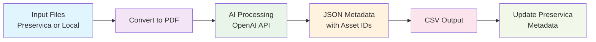
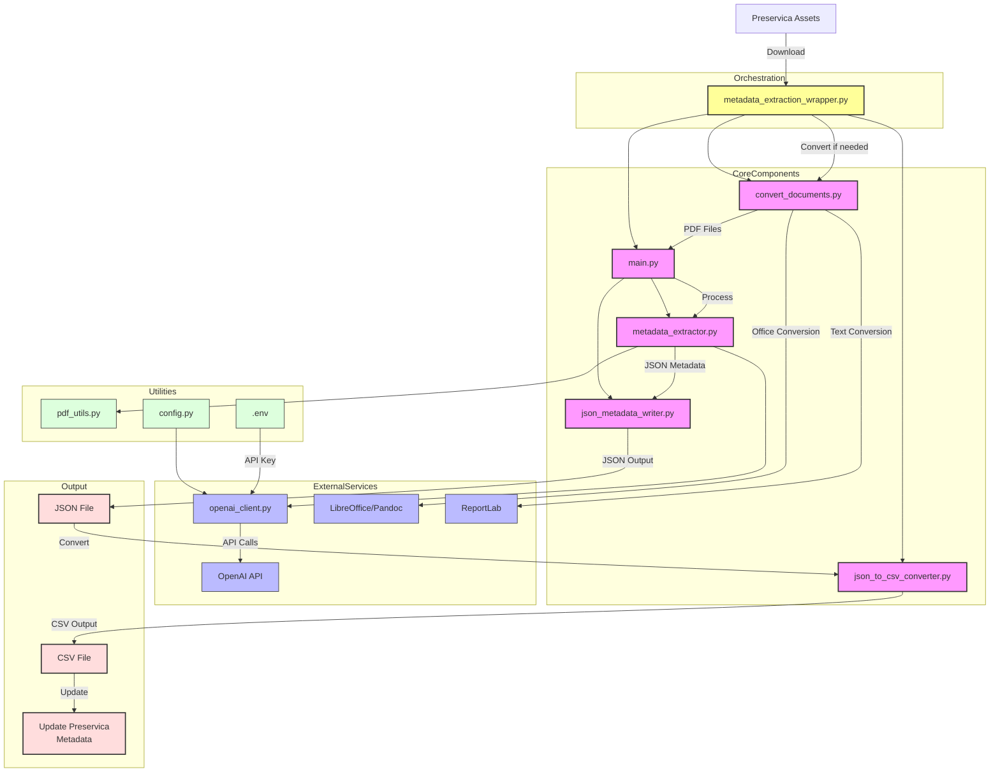

# Metadata Extraction Tool

An experimental AI-powered metadata extraction system that processes various document formats and extracts structured metadata using OpenAI's API. Extraction rules are driven by configurable YAML profiles, making the tool adaptable to different organisations and metadata conventions.

## Overview

This project showcases an end-to-end document processing pipeline that:
- Downloads assets from Preservica digital preservation system or processes local files
- Converts multiple document formats to PDF for consistent processing
- Extracts structured metadata using AI/LLM technology
- Applies organisation-specific conventions via configurable YAML profiles
- Maintains asset ID links for metadata updates and further processing
- Outputs results in both JSON and CSV formats
- Updates Preservica metadata using the extracted information
- Preserves original format information throughout the pipeline

## Demo


*This demo shows the complete workflow: downloading assets from Preservica, AI-powered metadata extraction using OpenAI, and JSON output generation.*

## Web UI (Experimental)

A browser-based interface built with [Streamlit](https://streamlit.io) is available as an alternative to the command line.

### Starting the UI

```bash
streamlit run app.py
```

The app opens automatically in your browser at `http://localhost:8501`.

### Input Modes

| Mode | Description |
|------|-------------|
| **Select files** | Upload PDFs, Office documents, or images directly from your computer |
| **Local folder** | Point to a directory on disk; non-PDF files are converted to PDF automatically |
| **Preservica** | Download and process assets from a Preservica repository using a folder reference UUID |

### Sidebar Settings

| Setting | Description |
|---------|-------------|
| **Profile** | Select the metadata extraction profile that defines the organisation-specific conventions and output fields (see [Profiles](#profiles)) |
| **Subject classification** | Classify documents against the topic hierarchy defined in the active profile (enabled by default; disable to leave the Subject field empty) |
| **Pages from start / end** | Restrict extraction to the opening and/or closing pages of each document; set both to 0 to process the full document |
| **Context prompt** | Optional background text to help the model identify subjects — for example, the collection, event, or location the documents belong to |
| **JSON / CSV save paths** | Save output files directly to disk; leave blank to use only the download buttons |

### Results and Downloads

After extraction, each document's metadata appears in an expandable card showing title, content type, date, creator, publisher, description, subjects, and identifiers. A collapsible **Full JSON** view is available inside each card.

Use the **Download JSON** and **Download CSV** buttons at the bottom of the page to export results.

### Preservica-Specific Options

When **Preservica** mode is selected, additional options appear:

- **Download by** — choose between **Folder** (all assets under a folder UUID) or **Asset IDs** (one or more specific asset UUIDs entered one per line)
- **Exclude file extensions** — skip specific file types during download (e.g. `mp4 avi mov`), space-separated
- **Use asset reference in filenames** — prefix downloaded filenames with the Preservica asset reference number
- **Original files only** — download only the first-generation file for each asset

> **Note:** Preservica credentials (`USERNAME`, `PASSWORD`, `TENANT`, `SERVER`) must be set in your `.env` file to enable Preservica downloads.

---

## System Flow


```mermaid
graph LR
    A[Input Files<br/>Preservica or Local] --> B[Convert to PDF]
    B --> C[AI Processing<br/>OpenAI API]
    C --> D[JSON Metadata<br/>with Asset IDs]
    D --> E[CSV Output]
    E --> F[Update Preservica<br/>Metadata]
    
    style A fill:#e1f5fe
    style B fill:#f3e5f5
    style C fill:#e8f5e8
    style D fill:#fff3e0
    style E fill:#fce4ec
    style F fill:#f1f8e9
```

## System Architecture


```mermaid
graph TD
    %% Main Components
    Wrapper[metadata_extraction_wrapper.py] --> Main[main.py]
    Wrapper --> Converter[convert_documents.py]
    Wrapper --> JSONConverter[json_to_csv_converter.py]
    Main --> Extractor[metadata_extractor.py]
    Main --> JSONWriter[json_metadata_writer.py]
    
    %% Metadata Extractor Dependencies
    Extractor --> OpenAIClient[openai_client.py]
    Extractor --> PDFUtils[pdf_utils.py]
    
    %% Configuration and Environment
    Config[config.py] --> OpenAIClient
    Env[.env] -->|API Key| OpenAIClient
    
    %% Data Flow
    PreservicaAssets[Preservica Assets] -->|Download| Wrapper
    Wrapper -->|Convert if needed| Converter
    Converter -->|PDF Files| Main
    Main -->|Process| Extractor
    Extractor -->|JSON Metadata| JSONWriter
    JSONWriter -->|JSON Output| JSONFile[JSON File]
    JSONFile -->|Convert| JSONConverter
    JSONConverter -->|CSV Output| CSVFile[CSV File]
    CSVFile -->|Update| PreservicaUpdate[Update Preservica<br/>Metadata]
    
    %% External Services
    OpenAIClient -->|API Calls| OpenAI[OpenAI API]
    Converter -->|Office Conversion| LibreOffice[LibreOffice/Pandoc]
    Converter -->|Text Conversion| ReportLab[ReportLab]
    
    %% Component Details
    subgraph Orchestration
        Wrapper
    end
    
    subgraph CoreComponents
        Main
        Extractor
        JSONWriter
        Converter
        JSONConverter
    end
    
    subgraph ExternalServices
        OpenAIClient
        OpenAI
        LibreOffice
        ReportLab
    end
    
    subgraph Utilities
        PDFUtils
        Config
        Env
    end
    
    subgraph Output
        JSONFile
        CSVFile
        PreservicaUpdate
    end
    
    %% Styling
    classDef primary fill:#f9f,stroke:#333,stroke-width:2px
    classDef secondary fill:#bbf,stroke:#333,stroke-width:1px
    classDef utility fill:#dfd,stroke:#333,stroke-width:1px
    classDef wrapper fill:#ff9,stroke:#333,stroke-width:2px
    classDef output fill:#fdd,stroke:#333,stroke-width:2px
    
    class Wrapper wrapper
    class Main,Extractor,JSONWriter,Converter,JSONConverter primary
    class OpenAIClient,OpenAI,LibreOffice,ReportLab secondary
    class PDFUtils,Config,Env utility
    class JSONFile,CSVFile,PreservicaUpdate output
```

## Technical Implementation

The system is built with Python and integrates several key technologies:
- **OpenAI API**: For AI-powered metadata extraction
- **LibreOffice/Pandoc**: For document format conversion
- **ReportLab**: For text-to-PDF conversion
- **PyPDF2**: For PDF file operations
- **JSON/CSV**: For structured data output

### Why PDF Conversion?

The system converts all documents to PDF before LLM processing to provide:
- **Consistent Input Format**: Standardized structure for reliable LLM processing
- **Preserved Layout**: Maintains document hierarchy and formatting context
- **Direct AI Processing**: PDFs are uploaded directly to OpenAI for text extraction and analysis
- **Format Preservation**: Original format information maintained in metadata

## Supported File Formats

The tool supports the following file formats:
- **PDF** (.pdf) - Processed directly
- **Office Documents** (.docx, .doc, .xlsx, .pptx, .ppt) - Converted to PDF
- **Text Files** (.txt, .srt, .vtt) - Converted to PDF
- **Images** (.jpg, .jpeg, .png, .tiff, .tif) - Converted to PDF

## Capabilities

### Document Processing Pipeline

The system demonstrates a complete document processing workflow:

```bash
# Complete workflow (Preservica folder)
python metadata_extraction_wrapper.py --preservica-folder-ref <uuid> --output-dir ./downloads

# Download a single asset by ID
python metadata_extraction_wrapper.py --preservica-asset-ref <uuid> --output-dir ./downloads

# Download a list of specific assets (one UUID per line in assets.txt)
python metadata_extraction_wrapper.py --preservica-assets-file assets.txt --output-dir ./downloads

# Skip download, process existing files
python metadata_extraction_wrapper.py --skip-download --output-dir ./downloads

# Individual components
python convert_documents.py <directory_path>  # Convert to PDF
python main.py --folder pdf_directory -j output.json  # Extract metadata
python json_to_csv_converter.py output.json output.csv  # Convert to CSV
```

### Key Features

- **Multi-format Support**: Handles PDF, DOCX, DOC, XLSX, PPTX, PPT, TXT, SRT, VTT, and image files
- **Profile-Based Configuration**: YAML profiles define extraction rules, field vocabulary, and output structure per organisation
- **Format Preservation**: Maintains original format information through conversion process
- **AI-Powered Extraction**: Uses OpenAI's API for intelligent metadata extraction
- **Dual Output**: Generates both JSON (structured) and CSV (tabular) outputs
- **Page Selection**: Supports processing specific page ranges for large documents

## Profiles

Extraction rules, field vocabulary, and output structure are defined in YAML profile files stored in the `profiles/` directory. Two profiles are included:

| Profile | File | Description |
|---------|------|-------------|
| **ICAEW** | `profiles/icaew.yaml` | Full ICAEW digital archive conventions — XIP fields, `icaew:ContentType` vocabulary, British English rules, ICAEW topic hierarchy |
| **Default** | `profiles/default.yaml` | Minimal generic Dublin Core profile — a clean starting point for any organisation |

The active profile is selected from the sidebar in the UI, or via `--profile` on the command line. To create a profile for your own organisation, copy `profiles/default.yaml`, rename it, and edit the fields. See [GETTING_STARTED.md](GETTING_STARTED.md) for a step-by-step guide.

## Metadata Schema

The output fields depend on the active profile. All profiles produce at minimum the standard Dublin Core fields:

- `Title`, `Creator`, `Subject`, `Description`, `Publisher`, `Contributor`
- `Date`, `Type`, `Format`, `Identifier`, `Language`, `Relation`
- `Source`, `Coverage`, `Rights` (reserved — always empty)

The **ICAEW profile** additionally outputs:
- `entity.title`, `entity.description` — mirror fields used by Preservica's XIP schema
- `icaew:ContentType` — controlled vocabulary content type (Annual report, Article, Report, Technical release, etc.)
- `icaew:InternalReference` — reserved for future use
- `icaew:Notes` — free-text notes

## AI Integration

### How the AI is guided
The AI model is given a detailed system prompt assembled from the active profile. The prompt includes:
- A role statement describing the archive and its conventions
- Numbered extraction guidelines (generic rules + any profile-specific additions)
- Full field-by-field instructions for every output field
- A subject topic list for classification (if the profile provides one)
- Example outputs showing the expected JSON structure and field values

### AI Configuration
- Uses OpenAI's GPT models for intelligent metadata extraction
- All rules and conventions are defined in YAML profiles — no code changes needed to adapt the tool
- Handles complex document structures and varied content types

## Format Mapping and Preservation

The system automatically creates a `format_mapping.json` file during document conversion to preserve original file format information. This ensures that:

- **Accurate Metadata**: The `dc:format` field correctly shows the original format (e.g., "xlsx", "pptx", "jpg") instead of "pdf"
- **Format Tracking**: Each converted PDF is linked to its original source format
- **Metadata Integrity**: Users can distinguish between native PDFs and converted documents
- **Audit Trail**: Complete visibility into the conversion process

### Format Mapping Example:
```json
{
  "downloads/document.pdf": "xlsx",
  "downloads/presentation.pdf": "pptx",
  "downloads/image.pdf": "jpg"
}
```

## Dependencies

- **Python Packages**: openai, python-dotenv, PyPDF2, reportlab, Pillow, pyPreservica, pyyaml, streamlit (web UI)
- **External Tools**: LibreOffice or Pandoc for document conversion

Install all Python dependencies with:

```bash
pip install -r requirements.txt
```

The web UI's **Browse** folder picker also requires `tkinter`, which on Ubuntu/Debian must be installed separately:

```bash
sudo apt install python3-tk
```

## File Structure

Key files:
- `app.py` - Streamlit web UI (experimental)
- `download_preservica_assets.py` - Preservica asset download script
- `metadata_extraction_wrapper.py` - Main orchestration script
- `main.py` - Metadata extraction CLI
- `convert_documents.py` - Multi-format to PDF conversion
- `metadata_extractor.py` - Core extraction logic
- `json_metadata_writer.py` - JSON output handling
- `json_to_csv_converter.py` - JSON to CSV conversion
- `openai_client.py` - OpenAI API integration
- `config.py` - Prompt builder; loads profiles and assembles the AI system prompt
- `profiles/icaew.yaml` - ICAEW digital archive extraction profile
- `profiles/default.yaml` - Generic Dublin Core profile (starting point for customisation)
- `topic_list.txt` - ICAEW subject topic hierarchy used by the ICAEW profile

## Workflow

1. **Input**: Assets downloaded from Preservica or local files placed in working directory
2. **Convert**: Non-PDF files converted to PDF while preserving original format information
3. **Extract**: AI-powered metadata extraction from PDF files
4. **Output**: Metadata written to JSON format
5. **Convert**: JSON metadata converted to CSV format
6. **Update**: CSV output used to update Preservica metadata using preserved asset IDs

## Preservica Integration

The system integrates with Preservica digital preservation system to:

- **Asset Download**: Downloads assets from Preservica using folder or asset references
- **Asset ID Tracking**: Maintains Preservica asset IDs throughout the processing pipeline
- **Metadata Linking**: Links extracted metadata back to original Preservica assets
- **Update Capability**: Enables further scripting to update Preservica metadata using extracted information

### Asset ID Preservation

Each processed document maintains its Preservica asset ID in the output metadata:
- **JSON Output**: Asset ID stored in `assetId` field for each record
- **CSV Output**: Asset ID included as first column for easy reference
- **Update Workflow**: Asset IDs enable automated metadata updates back to Preservica

### Metadata Update Process

The CSV output serves as the primary input for updating Preservica metadata:
- **Structured Data**: CSV format provides clean, tabular data for bulk updates
- **Asset Linking**: First column contains Preservica asset IDs for precise targeting
- **Bulk Processing**: Enables efficient batch updates of multiple assets
- **Data Integrity**: Preserves all extracted metadata fields for comprehensive updates

## Project Status

This is an experimental project demonstrating AI-powered document processing capabilities. The system showcases:

- **Preservica Integration**: Seamless download and metadata linking with digital preservation system
- **Document Format Conversion**: Multi-format to PDF conversion pipeline
- **AI-Powered Metadata Extraction**: Intelligent content analysis and classification
- **Structured Data Output**: JSON and CSV format generation with asset tracking
- **Metadata Update Workflow**: CSV output enables bulk updates back to Preservica
- **Format Preservation**: Maintaining original file format information
- **Modular Architecture**: Component-based design for flexibility

The project serves as a proof-of-concept for automated document processing workflows using modern AI technologies, with the ultimate goal of enhancing Preservica metadata through AI-powered extraction and bulk update capabilities.

For installation and setup instructions, including how to create a custom profile for your organisation, see [GETTING_STARTED.md](GETTING_STARTED.md).