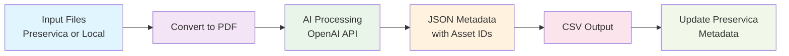
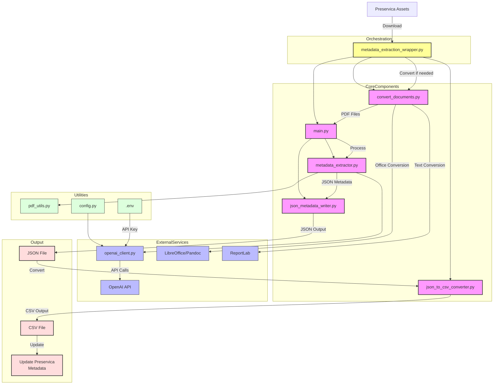

# Metadata Extraction Tool

An AI-powered tool that reads documents and extracts structured metadata — title, creator, date, description, subject tags, and more — using OpenAI's API. Extraction rules are driven by configurable YAML profiles, making the tool adaptable to different organisations and metadata conventions.

**New here?** See [GETTING_STARTED.md](GETTING_STARTED.md) for a step-by-step install and setup guide, including how to create a profile for your own organisation.

## What it does

- Processes PDFs, Word documents, spreadsheets, presentations, images, and text files
- Extracts structured Dublin Core metadata using an AI model
- Applies organisation-specific conventions via configurable YAML profiles
- Outputs results in JSON and CSV formats
- Integrates with Preservica: download assets, extract metadata, and link results back to asset records

## Demo


*Complete workflow: downloading assets from Preservica, AI-powered metadata extraction, and JSON output generation.*

---

## Web UI

A browser-based interface built with [Streamlit](https://streamlit.io):

```bash
streamlit run app.py
```

The app opens automatically in your browser at `http://localhost:8501`.

### Input modes

| Mode | Description |
|------|-------------|
| **Select files** | Upload PDFs, Office documents, or images directly from your computer |
| **Local folder** | Point to a directory on disk; non-PDF files are converted to PDF automatically |
| **Preservica** | Download and process assets from a Preservica repository using a folder reference UUID |

### Sidebar settings

| Setting | Description |
|---------|-------------|
| **Profile** | Select the metadata extraction profile that defines the organisation-specific conventions and output fields (see [Profiles](#profiles)) |
| **Subject classification** | Classify documents against the topic hierarchy defined in the active profile (enabled by default; disable to leave the Subject field empty) |
| **Pages from start / end** | Restrict extraction to the opening and/or closing pages of each document; set both to 0 to process the full document |
| **Context prompt** | Optional background text to help the model identify subjects — for example, the collection, event, or location the documents belong to |
| **JSON / CSV save paths** | Save output files directly to disk; leave blank to use only the download buttons |

### Results and downloads

After extraction, each document's metadata appears in an expandable card showing title, content type, date, creator, publisher, description, subjects, and identifiers. A collapsible **Full JSON** view is available inside each card.

Use the **Download JSON** and **Download CSV** buttons to export results.

### Preservica options

When **Preservica** mode is selected, additional options appear:

- **Download by** — choose between **Folder** (all assets under a folder UUID) or **Asset IDs** (one or more specific asset UUIDs entered one per line)
- **Exclude file extensions** — skip specific file types during download (e.g. `mp4 avi mov`), space-separated
- **Use asset reference in filenames** — prefix downloaded filenames with the Preservica asset reference number
- **Original files only** — download only the first-generation file for each asset

> **Note:** Preservica credentials (`USERNAME`, `PASSWORD`, `TENANT`, `SERVER`) must be set in your `.env` file to enable Preservica downloads.

---

## Profiles

Extraction rules, field vocabulary, and output structure are defined in YAML profile files in the `profiles/` directory. Two profiles are included:

| Profile | File | Description |
|---------|------|-------------|
| **ICAEW** | `profiles/icaew.yaml` | Full ICAEW digital archive conventions — XIP fields, `icaew:ContentType` vocabulary, British English rules, ICAEW topic hierarchy |
| **Default** | `profiles/default.yaml` | Minimal generic Dublin Core profile — a clean starting point for any organisation |

Select the active profile from the sidebar in the UI, or via `--profile` on the command line. To create a profile for your own organisation, copy `profiles/default.yaml`, rename it, and edit the fields. See [GETTING_STARTED.md](GETTING_STARTED.md) for a step-by-step guide.

The AI model is given a system prompt assembled from the active profile, including:
- A role statement describing the archive and its conventions
- Numbered extraction guidelines (generic rules + any profile-specific additions)
- Field-by-field instructions for every output field
- A subject topic list for classification (if the profile provides one)
- Example outputs showing the expected JSON structure and field values

---

## Supported file formats

| Format | Extensions | Processing |
|--------|------------|------------|
| PDF | `.pdf` | Processed directly |
| Office documents | `.docx`, `.doc`, `.xlsx`, `.pptx`, `.ppt` | Converted to PDF |
| Text files | `.txt`, `.srt`, `.vtt` | Converted to PDF |
| Images | `.jpg`, `.jpeg`, `.png`, `.tiff`, `.tif` | Converted to PDF |

---

## Metadata schema

The output fields depend on the active profile. All profiles produce at minimum the standard Dublin Core fields:

- `Title`, `Creator`, `Subject`, `Description`, `Publisher`, `Contributor`
- `Date`, `Type`, `Format`, `Identifier`, `Language`, `Relation`
- `Source`, `Coverage`, `Rights` (reserved — always empty)

The **ICAEW profile** additionally outputs:
- `entity.title`, `entity.description` — mirror fields used by Preservica's XIP schema
- `icaew:ContentType` — controlled vocabulary content type (Annual report, Article, Report, Technical release, etc.)
- `icaew:InternalReference` — reserved for future use
- `icaew:Notes` — free-text notes

---

## Command line

```bash
# Process all files in a folder using the default profile
python main.py --folder ./my-documents -j output.json

# Use a specific profile
python main.py --folder ./my-documents --profile icaew -j output.json

# Limit to the first 5 and last 3 pages of each document
python main.py --folder ./my-documents --first 5 --last 3 -j output.json

# Disable subject classification
python main.py --folder ./my-documents --no-subjects -j output.json

# Convert JSON output to CSV
python json_to_csv_converter.py output.json output.csv
```

For Preservica downloads:

```bash
# Complete workflow — download a folder, extract metadata, output JSON + CSV
python metadata_extraction_wrapper.py --preservica-folder-ref <uuid> --output-dir ./downloads

# Download a single asset
python metadata_extraction_wrapper.py --preservica-asset-ref <uuid> --output-dir ./downloads

# Download a list of assets (one UUID per line in assets.txt)
python metadata_extraction_wrapper.py --preservica-assets-file assets.txt --output-dir ./downloads

# Skip download, process existing files
python metadata_extraction_wrapper.py --skip-download --output-dir ./downloads
```

Run any script with `--help` to see all available options.

---

## Preservica integration

The tool integrates with Preservica to:

- Download assets using folder or asset references
- Maintain Preservica asset IDs (`assetId`) throughout the pipeline — stored in the JSON output and as the first column in the CSV
- Enable batch metadata updates back to Preservica using the CSV output

---

## Pipeline


```mermaid
graph LR
    A[Input Files<br/>Preservica or Local] --> B[Convert to PDF]
    B --> C[AI Processing<br/>OpenAI API]
    C --> D[JSON Metadata<br/>with Asset IDs]
    D --> E[CSV Output]
    E --> F[Update Preservica<br/>Metadata]
    
    style A fill:#e1f5fe
    style B fill:#f3e5f5
    style C fill:#e8f5e8
    style D fill:#fff3e0
    style E fill:#fce4ec
    style F fill:#f1f8e9
```

<details>
<summary>System architecture diagram</summary>


```mermaid
graph TD
    %% Main Components
    Wrapper[metadata_extraction_wrapper.py] --> Main[main.py]
    Wrapper --> Converter[convert_documents.py]
    Wrapper --> JSONConverter[json_to_csv_converter.py]
    Main --> Extractor[metadata_extractor.py]
    Main --> JSONWriter[json_metadata_writer.py]
    
    %% Metadata Extractor Dependencies
    Extractor --> OpenAIClient[openai_client.py]
    Extractor --> PDFUtils[pdf_utils.py]
    
    %% Configuration and Environment
    Config[config.py] --> OpenAIClient
    Env[.env] -->|API Key| OpenAIClient
    
    %% Data Flow
    PreservicaAssets[Preservica Assets] -->|Download| Wrapper
    Wrapper -->|Convert if needed| Converter
    Converter -->|PDF Files| Main
    Main -->|Process| Extractor
    Extractor -->|JSON Metadata| JSONWriter
    JSONWriter -->|JSON Output| JSONFile[JSON File]
    JSONFile -->|Convert| JSONConverter
    JSONConverter -->|CSV Output| CSVFile[CSV File]
    CSVFile -->|Update| PreservicaUpdate[Update Preservica<br/>Metadata]
    
    %% External Services
    OpenAIClient -->|API Calls| OpenAI[OpenAI API]
    Converter -->|Office Conversion| LibreOffice[LibreOffice/Pandoc]
    Converter -->|Text Conversion| ReportLab[ReportLab]
    
    subgraph Orchestration
        Wrapper
    end
    
    subgraph CoreComponents
        Main
        Extractor
        JSONWriter
        Converter
        JSONConverter
    end
    
    subgraph ExternalServices
        OpenAIClient
        OpenAI
        LibreOffice
        ReportLab
    end
    
    subgraph Utilities
        PDFUtils
        Config
        Env
    end
    
    subgraph Output
        JSONFile
        CSVFile
        PreservicaUpdate
    end
    
    classDef primary fill:#f9f,stroke:#333,stroke-width:2px
    classDef secondary fill:#bbf,stroke:#333,stroke-width:1px
    classDef utility fill:#dfd,stroke:#333,stroke-width:1px
    classDef wrapper fill:#ff9,stroke:#333,stroke-width:2px
    classDef output fill:#fdd,stroke:#333,stroke-width:2px
    
    class Wrapper wrapper
    class Main,Extractor,JSONWriter,Converter,JSONConverter primary
    class OpenAIClient,OpenAI,LibreOffice,ReportLab secondary
    class PDFUtils,Config,Env utility
    class JSONFile,CSVFile,PreservicaUpdate output
```

</details>

---

## Dependencies

- **Python packages**: openai, python-dotenv, PyPDF2, reportlab, Pillow, pyPreservica, pyyaml, streamlit (web UI)
- **External tools**: LibreOffice or Pandoc for document conversion

```bash
pip install -r requirements.txt
```

The web UI's Browse folder picker also requires `tkinter`, which on Ubuntu/Debian must be installed separately:

```bash
sudo apt install python3-tk
```

---

## File structure

Key files:
- `app.py` — Streamlit web UI
- `main.py` — Metadata extraction CLI
- `metadata_extraction_wrapper.py` — Orchestration script (download + convert + extract)
- `convert_documents.py` — Multi-format to PDF conversion
- `metadata_extractor.py` — Core extraction logic
- `openai_client.py` — OpenAI API integration
- `config.py` — Prompt builder; loads profiles and assembles the AI system prompt
- `json_metadata_writer.py` — JSON output handling
- `json_to_csv_converter.py` — JSON to CSV conversion
- `download_preservica_assets.py` — Preservica asset download
- `profiles/icaew.yaml` — ICAEW digital archive extraction profile
- `profiles/default.yaml` — Generic Dublin Core profile (starting point for customisation)
- `topic_list.txt` — ICAEW subject topic hierarchy used by the ICAEW profile
